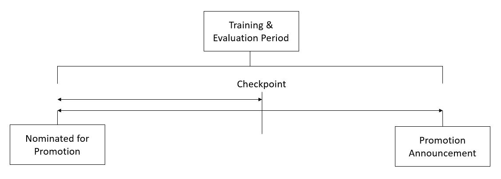

# AV WNS - Job Promotion Prediction

**Hiring Hackathon : Job Promotion Prediction** 

Website: https://datahack.analyticsvidhya.com/contest/wns-analytics-hackathon-2018/

**Notes to self**
This is my 4nd hackathon in AV. 


## Tags

Classification 


## Description

## Problem Statement

Your client is a large MNC and they have 9 broad verticals across the organisation. One of the problem your client is facing is around identifying the right people for promotion (only for manager position and below) and prepare them in time. Currently the process, they are following is:

1. They first identify a set of employees based on recommendations/ past performance
2. Selected employees go through the separate training and evaluation program for each vertical. These programs are based on the required skill of each vertical
3. At the end of the program, based on various factors such as training performance, KPI completion (only employees with KPIs completed greater than 60% are considered) etc., employee gets promotion

For above mentioned process, the final promotions are only announced after the evaluation and this leads to delay in transition to their new roles. Hence, company needs your help in identifying the eligible candidates at a particular checkpoint so that they can expedite the entire promotion cycle.



They have provided multiple attributes around Employee's past and current performance along with demographics. Now, The task is to predict whether a potential promotee at checkpoint in the test set will be promoted or not after the evaluation process.

------

## Data

| **Variable**         | **Definition**                                               |
| -------------------- | ------------------------------------------------------------ |
| employee_id          | Unique ID for employee                                       |
| department           | Department of employee                                       |
| region               | Region of employment (unordered)                             |
| education            | Education Level                                              |
| gender               | Gender of Employee                                           |
| recruitment_channel  | Channel of recruitment for employee                          |
| no_of_trainings      | no of other trainings completed in previous year on soft skills, technical skills etc. |
| age                  | Age of Employee                                              |
| previous_year_rating | Employee Rating for the previous year                        |
| length_of_service    | Length of service in years                                   |
| KPIs_met >80%        | if Percent of KPIs(Key performance Indicators) >80% then 1 else 0 |
| awards_won?          | if awards won during previous year then 1 else 0             |
| avg_training_score   | Average score in current training evaluations                |
| is_promoted          | (Target) Recommended for promotion                           |

### EVALUATION METRIC

The evaluation metric for this competition is F1 Score.


### PUBLIC AND PRIVATE SPLIT

Test data is further randomly divided into Public (40%) and Private (60%) data.

- Your initial responses will be checked and scored on the Public data.
- The final rankings would be based on your private score which will be published once the competition is over.


### WNS Hackathon Rules

1. Entries submitted after the contest is closed will not be considered.
2. Use of external dataset is strictly prohibited.
3. Use of employee_id as a feature or in any way to build the model is not allowed


### Solution Checker

1. You are only allowed to make 15 submissions per day
2. Adding comments is mandatory for the use of solution checker
3. Comments will help you to refer to a particular solution at a later point in time.


### Final Submission

1. Setting final submission is mandatory. Without a final submission, your entry will not be considered.
2. Code file is mandatory while sending final submission. For GUI based tools, please upload a zip file of snapshots of steps taken by you, else upload code file.
3. The code file uploaded should be pertaining to your final submission.


### Lessons Learnt

* Don't do Feature Selection early on. Begin with including all features and set that as your baseline.

* Typical Steps To Follow (Skip any  at your own risk):

  * Data Cleaning

  * Feature Pre-processing

    * Make all features numeric (at the very least)

      ```python
      def numerify(ser):
          return LabelEncoder().fit_transform(ser)
      
      df2 = df.copy()
      
      df2['department'] = numerify(df2['department'])
      df2['region'] = numerify(df2['region'])
      
      ##Split train data-set
      from sklearn.model_selection import train_test_split
      x_train, x_test, y_train, y_test = train_test_split(df2[df2.columns.difference(['is_promoted'])], 
                                                          df2['is_promoted'], 
                                                          train_size = 0.75, 
                                                          random_state = 42)
      
      ## Find Feature Importances
      from sklearn.ensemble import RandomForestClassifier
      rf = RandomForestClassifier(n_estimators=100, n_jobs=-1, random_state=42)
      rf.fit(x_train, y_train)
      
      names = df2.columns.values #select_columns #x_train.columns
      scores = map(lambda x: round(x, 4), rf.feature_importances_)
      score_map = zip(scores, names)
      print("Features sorted by their score:")
      # for a,b in sorted(score_map, reverse=True):
      for a,b in sorted(score_map, reverse=True):
          print(a,b)
      ```

  * Feature Selection and Construction

    * Rank Features by Importance with `df.corr()`

    * Select N features:

      ```python
      feat_sel = SelectKBest(mutual_info_classif, k=200)
      
      feat_sel = SelectKBest(mutual_info_classif, k=200)  
      clf = linear_model.LogisticRegression()
      
      pipe = Pipeline([('vectorizer', DictVectorizer()),
                       ('scaler', StandardScaler(with_mean=False)),
                       ('mutual_info', feat_sel),
                       ('logistregress', clf)])
      ```

  * Model Selection

  * Parameter Optimization

  * Model Validation

* Issue getting the  below class to work:

  ```python
  class MultiColumnLabelEncoder:
      def __init__(self,columns = None):
          self.columns = columns # array of column names to encode
          self.le = {}
  
      def get_encoder(self,name):
          encoder = self.le.get(name, self.set_encoder_for(name))        
          return encoder
      
      def set_encoder_for(self,name):
          self.le.update({name:LabelEncoder()})
          return self.le.get(name)
      
      def fit(self,X,y=None):
          output = X.copy()
          if self.columns is not None:
              for colname in self.columns:
                  self.get_encoder(colname).fit(output[colname])
          else:
              for colname,col in output.iteritems():
                  self.get_encoder(colname).fit(col)
          return self # not relevant here
  
      def transform(self,X):
          '''
          Transforms columns of X specified in self.columns using LabelEncoder(). 
          If no columns specified, transforms all columns in X.
          '''
          output = X.copy()
          if self.columns is not None:
              for col in self.columns:
                  output[col] = self.get_encoder(col).transform(output[col])
          else:
              for colname,col in output.iteritems():
                  output[colname] = self.get_encoder(colname).transform(col)
          return output
  
      def fit_transform(self,X,y=None):
          return self.fit(X,y).transform(X)
  ```

* `LabelEncoder` (which is actually meant for the target variable, not for encoding features). See [source](https://jorisvandenbossche.github.io/blog/2017/11/20/categorical-encoder/). The `OneHotEncoder` and `OrdinalEncoder` only provide two ways to encode, but there are many more possible ways to convert your categorical variables into numeric features suited to feed 
  into models. The [Category Encoders](http://contrib.scikit-learn.org/categorical-encoding/) is a scikit-learn-contrib package that provides a whole suite of 
  scikit-learn compatible transformers for different types of categorical encodings.